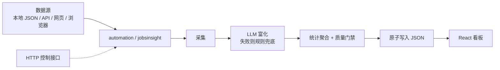

# 医药健康 + AI 岗位洞察

<p align="center">
  <strong>会自己跑的招聘数据看板</strong><br>
  按你设定的时间采集岗位 → LLM 规范化与分析 → 原子写入 JSON → React 看板直接展示
</p>

<p align="center">
  
  
  
  
</p>

<p align="center">
  <a href="#-快速开始">快速开始</a> ·
  <a href="#-当前版本">当前版本</a> ·
  <a href="#-数据怎么流动">数据流</a> ·
  <a href="#-自定义运行时间">运行时间</a> ·
  <a href="#-数据源">数据源</a> ·
  <a href="#-生产部署检查">生产检查</a>
</p>

---

## 当前版本

| 模块 | 能力 | 说明 |
| --- | --- | --- |
| 调度 | 每天定点 / cron / 间隔 / 手动 | 本地守护进程与 GitHub Actions 共用同一套时间规则 |
| LLM | OpenAI 兼容 / Anthropic / Ollama / mock | 失败自动回退规则解析，不会让整次运行中断 |
| 采集 | 本地 JSON / JSON API / 网页+LLM / 浏览器 | 浏览器模式使用你授权的登录会话，不绕过验证码 |
| 发布 | 必需来源 · 最低采集量 · 相关度 · 质量分 | 不达标时保留上一版有效数据 |
| 观测 | 数据版本 · 来源健康 · 新鲜度 · `doctor` | 前端状态条和 `/api/health` 都能看到 |
| 前端 | 实时 API 优先，静态快照回退 | GitHub Pages 子路径也能正确加载数据 |

> 仓库默认启用 **fixture 示例数据 + mock LLM**，无需账号即可跑通全流程。  
> 要持续获取真实招聘数据，请按 [数据源](#-数据源) 配置你有权访问的接口或浏览器账号，并遵守平台条款。

## 数据怎么流动



一次运行的顺序是：**采集 → 富化 → 过滤 → 质量检查 → 落盘**。  
必需来源失败、采集量不足或质量分过低时，**不会覆盖**上一版 `jobs.json`。

---

## 快速开始

后端核心只用标准库，Python 3.11+ 即可；浏览器采集才需要可选 Playwright。

<details>
<summary><strong>1. 跑通离线流水线</strong></summary>

```bash
cd automation
python -m jobsinsight doctor   # 检查配置、来源、目录和已有数据
python -m jobsinsight run      # 默认 mock，不需要 API Key
python -m jobsinsight next-runs
```

</details>

<details>
<summary><strong>2. 启动看板</strong></summary>

```bash
cd web
npm install
npm run dev      # http://localhost:5173
npm run build    # 产物在 web/dist
```

`npm run dev` 会把 `/api` 代理到 `127.0.0.1:8787`。后端未启动时，页面自动读取 `public/data` 快照。

</details>

<details>
<summary><strong>3. 常驻运行或一键 Docker</strong></summary>

```bash
# 到点自动执行
python -m jobsinsight schedule

# HTTP 接口 + 可选调度器，同时托管构建好的前端
python -m jobsinsight serve      # http://127.0.0.1:8787

# 调度器 + 接口 + 前端一起跑
LLM_PROVIDER=deepseek LLM_MODEL=deepseek-chat LLM_API_KEY=sk-xxx docker compose up -d
```

</details>

---

## 自定义运行时间

写在 `automation/config.toml` 的 `[schedule]`，四种模式效果相同：

| 模式 | 字段 | 例子 | 何时用 |
| --- | --- | --- | --- |
| `daily` | `daily_times` | `["00:00", "12:30"]` | 每天固定时刻，可配多个 |
| `cron` | `cron` | `"30 */6 * * 1-5"` | 工作日、非整点、复杂日历 |
| `interval` | `interval_minutes` | `360` | 从上次成功运行起每隔 N 分钟 |
| `manual` | — | — | 只接受 CLI / 接口 / 前端按钮 |

配套选项：`timezone`（默认 `Asia/Shanghai`）、`jitter_seconds`、`catch_up`、`run_on_start`、`enabled`。

```bash
python -m jobsinsight set-schedule --at 08:30,20:30
python -m jobsinsight set-schedule --cron "30 */6 * * 1-5"
python -m jobsinsight set-schedule --every 90
python -m jobsinsight set-schedule --disable
```

运行中改时间立即生效：

```bash
curl -X PUT localhost:8787/api/schedule \
     -H 'Content-Type: application/json' \
     -d '{"mode":"daily","daily_times":["08:30","20:30"]}'
```

GitHub Actions 的 cron 是 UTC 且写死在 YAML 里，所以工作流用较粗的触发频率，真正是否执行由 `run --if-due` 判断。改完本地时间后执行 `python -m jobsinsight sync-cron`，会把 workflow 同步成对应的 UTC 时刻。

---

## LLM 调用接口

换 `provider` / `model` / `api_key` 即可切换厂商：

```toml
[llm]
provider = "deepseek"        # openai / moonshot / dashscope / zhipu / siliconflow / groq / ollama / anthropic / mock
model = "deepseek-chat"
api_key = "${DEEPSEEK_API_KEY}"
```

| Provider | 适用场景 |
| --- | --- |
| OpenAI 兼容 | OpenAI、DeepSeek、Kimi、通义、智谱、SiliconFlow、Groq、vLLM、Ollama、LM Studio；自建网关填 `base_url` |
| `anthropic` | Claude Messages API |
| `mock` | 离线演示和测试，不联网、不需要 Key |

流水线里 LLM 做三件事：规范化岗位字段、生成每日洞察、从网页抽取结构化岗位。  
调用层自带指数退避、限流间隔、JSON 修复和 token 统计。**任何一步 LLM 失败都不会让运行失败**，会退回 `heuristics.py` 并记入运行报告。

<details>
<summary>注册自定义厂商</summary>

```python
from jobsinsight.llm import register_provider, LLMProvider

class MyProvider(LLMProvider):
    name = "my-gateway"
    def complete(self, request): ...

register_provider("my-gateway", lambda options: MyProvider(**options))
```

</details>

---

## 数据源

`[[sources]]` 可以配多个，单个来源失败默认不影响整次运行；标了 `required = true` 的来源失败则拒绝发布。

| type | 用途 | 典型场景 |
| --- | --- | --- |
| `fixture` | 读本地 JSON | 默认示例、回放已保存的抓取结果 |
| `json_api` | JSON 接口 + `field_map` | 有搜索 API / Cookie 的平台 |
| `html_llm` | 网页转文本后交给 LLM 抽取 | 没有稳定 JSON 接口的页面 |
| `browser` | Playwright 持久化登录会话 | 必须登录才能看到岗位列表 |

51job / BOSS 直聘 / 猎聘的搜索地址、参数和 Cookie 会变，**不写死在代码里**。`automation/config.toml` 里有注释示例；默认数据源是 `automation/data/seed_postings.json`。

### 需要登录时

```bash
cp automation/config/accounts.example.toml automation/config/accounts.toml
# 用环境变量填账号密码，不要把明文提交进 Git
python -m jobsinsight browser-login boss
```

`accounts.toml`、Cookie 和 `storage_state` 均被 `.gitignore` 忽略。遇到验证码时程序会停止，需要人工登录；不会规避风控，请只用于你有权访问的账号。

生产来源建议同时设置：

- `required = true`
- 合理的 `min_collected`
- `output.min_quality_score`（可先观察实际分数再提高）

---

## HTTP 控制接口

`python -m jobsinsight serve` 之后可用：

| 方法 | 路径 | 说明 |
| --- | --- | --- |
| GET | `/api/health` | 健康检查：数据年龄、有效条数、最近状态 |
| GET | `/api/doctor` | 配置、来源、质量与新鲜度诊断 |
| GET | `/api/status` | 调度、LLM、来源健康、最近一次运行 |
| GET | `/api/config` | 脱敏后的完整配置 |
| GET / PUT | `/api/schedule` | 查看或修改运行时间 |
| GET / POST | `/api/runs` | 运行历史；POST 立即触发（支持 `async`） |
| POST | `/api/llm/chat` · `/api/llm/ask` | 透传对话 / 基于当前数据问答 |
| GET | `/api/data/<name>.json` | 读取产出文件 |

配置了 `server.auth_token` 后，写操作需要 `Authorization: Bearer <token>`；读接口保持开放，方便看板轮询。

---

## 产出的数据

写入 `web/public/data/`，全部原子落盘：

| 文件 | 内容 |
| --- | --- |
| `jobs.json` | 规范化后的岗位列表 |
| `stats.json` | 平台 / 城市 / 技能 / 薪资等聚合，含今日新增、更新、下架 |
| `insights.json` | 每日洞察（模型或统计规则） |
| `manifest.json` | run ID、数据版本、条数、来源、质量分、新鲜度 |

前端顶部状态条会显示版本、质量、来源和是否过期。监控可直接读 `/api/health`、`/api/status`、`/api/doctor`。

运行状态在 `automation/state/`（不入库）：

- `state.json` — 上次运行时间
- `runs.json` — 运行历史
- `jobs_snapshot.json` — 增量对比
- `sources_health.json` — 来源健康与连续失败次数
- `overrides.json` — 运行时改过的配置

---

## 配置优先级

```
内置默认值
    → 配置文件（config.toml / .json / .yaml）
    → 环境变量（JOBSINSIGHT_* 以及 ${VAR} / ${VAR:-默认值}）
    → 运行时覆盖（automation/state/overrides.json）
```

常用变量：`JOBSINSIGHT_LLM_API_KEY`、`JOBSINSIGHT_LLM_PROVIDER`、`JOBSINSIGHT_LLM_MODEL`、`JOBSINSIGHT_SCHEDULE_MODE`、`JOBSINSIGHT_SCHEDULE_DAILY_TIMES`、`JOBSINSIGHT_SCHEDULE_CRON`、`JOBSINSIGHT_SERVER_PORT`、`JOBSINSIGHT_SERVER_AUTH_TOKEN`。

**API Key 和招聘账号不要写进仓库。**

---

## 生产部署检查

1. 真实来源设置 `required = true` 和合理的 `min_collected`，避免登录过期时发布空数据。
2. 设置 `output.min_quality_score`：先观察实际质量分，再逐步提高门槛。
3. 把 API Key、账号密码和 `server.auth_token` 放到 Secret 或环境变量。
4. 首次部署执行 `python -m jobsinsight run`，确认 `manifest.json` 和来源健康记录已生成。
5. 执行 `python -m jobsinsight doctor --strict`；生产环境应处理完全部警告。
6. 用 `/api/health` 监控数据年龄，用 `/api/doctor` 查看具体故障。

---

## 开发

```bash
cd automation
python -m pytest
python -m ruff check .
python -m ruff format .
python -m jobsinsight run --dry-run

cd ../web
npm run lint && npm run build
```

更多细节：

- 后端：[automation/README.md](automation/README.md)
- 前端：[web/README.md](web/README.md)

---

## 目录结构

```
automation/                 Python 自动化后端（核心零依赖）
├── config.toml             运行时间、LLM、数据源、产出、接口
├── config/                 私密账号示例（真实 accounts.toml 不入库）
├── data/                   示例岗位 JSON
├── jobsinsight/
│   ├── cli.py              命令行
│   ├── pipeline.py         采集 → 富化 → 门禁 → 落盘
│   ├── quality.py          质量分与新鲜度
│   ├── diagnostics.py      doctor 预检
│   ├── collectors/         fixture / json_api / html_llm / browser
│   ├── llm/                统一 LLM 接口
│   └── server.py           HTTP 控制接口
└── tests/

web/                        React + TypeScript + Vite 看板
├── public/data/            流水线产出的 JSON
└── src/
    ├── App.tsx
    ├── components/AutomationPanel.tsx
    ├── components/DataStatusBar.tsx
    └── lib/automation.ts
```
